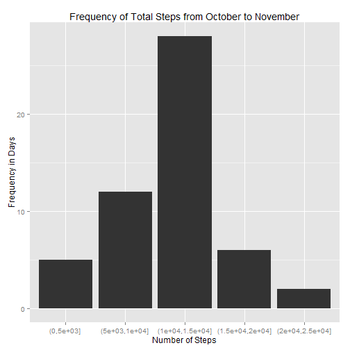

This R markdown document makes use of data from a personal monitoring device by analyzing it in multiple ways and creating visuals to display my analysis.

I loaded the *dplyr* and *ggplot2* packages to load the data onto RStudio and then I set my working directory, and then used:


```r
library('dplyr')
library('ggplot2')
data = read.csv('activity.csv')
print(head(data))
```

```
##   steps       date interval
## 1    NA 2012-10-01        0
## 2    NA 2012-10-01        5
## 3    NA 2012-10-01       10
## 4    NA 2012-10-01       15
## 5    NA 2012-10-01       20
## 6    NA 2012-10-01       25
```

For the first analysis I did, I created a histogram of the number of steps that was walked each day.  First, I had to figure out the total number of steps walked per day, so I grouped the data by the date, and then, used the handy *summarize*  function of the dplyr package to add the total number of steps walked per day.  Then I cut the totals into 4 ranges (using *cut* function) and graphed it as a histogram on ggplot2.  Also, the mean and median total steps walked from October to November was calculated.

```r
data = group_by(data, date)
data = summarize(data, Steps = sum(steps ,na.rm=TRUE))
factor = cut(data$Steps,pretty(data$Steps,4))
factor = data.frame(table(factor))
plot = qplot(factor, Freq, data=factor, geom="histogram", stat="identity")
plot = plot + labs(x="Number of Steps",y="Frequency in Days",title="Frequency of Total Steps from October to November")
mean = mean(data$Steps, na.rm=TRUE)
median = median(data$Steps, na.rm=TRUE)
print(plot)
```

 

```r
print(mean)
```

```
## [1] 9354.23
```

```r
print(median)
```

```
## [1] 10395
```
For my next analysis, I strived to determine daily activity patterns by creating a graph that calculated the average steps walked from in each  5-minute interval.  First, I grouped the data by each of the different intervals (using *group_by*), and then used the *summarize* function to calculate average steps walked for each 5-minute interval.  Then, I graphed it using ggplot2 and found out, on average, the user walked the most during interval 835.

```r
data = read.csv('activity.csv')
data = group_by(data, interval)
data = summarize(data, Steps = mean(steps ,na.rm=TRUE))
plot = qplot(interval, Steps, data=data, geom="line")
plot = plot + labs(x="5 Minute Interval",y="Steps Walked",title="Average Steps Walked in 5 Minute Intervals") + theme_bw()
highest = filter(data, Steps==max(data$Steps))
print(plot)
```

 

```r
print(highest)
```

```
## Source: local data frame [1 x 2]
## 
##   interval    Steps
## 1      835 206.1698
```
While I was looking at the data, I noticed that they were a lot of missing data, and conducting data analysis ignoring missing data is biased (2,304 missing data are in this data set).  So for this analysis I use the means each interval (the averages collected from the analysis above) and decided to fill in those averages to the missing data, and create a histogram with the missing data filled in.  To do this, I decided to find the average steps walked per interval in a new data frame, and then loop through my data to find missing data, look up the interval's average, and then replace the missing value with that value.  Next, I added the steps walked each day.  Finally I created the histogram, and calculated the new mean and median, which was surprisingly the same value.  This may be because some days were all missing data, so when the missing data were replaced by the means of the intervals, the median equaled the mean, and both increased, and the days with no data, fell into the 10000 to 15000 range.

```r
data = read.csv('activity.csv')
number_of_missing_values = length(filter(data, is.na(steps)==TRUE)$steps)
print(number_of_missing_values)
```

```
## [1] 2304
```

```r
averages = group_by(data, interval)
averages = summarize(averages, Steps = mean(steps ,na.rm=TRUE))
for (i in 1:length(data$steps)){
      if (is.na(data$steps[i]) == TRUE){
            data$steps[i] = filter(averages, interval == data$interval[i])$Steps
      }
}
```
The data with missing data replaced with the averages of the intervals.

```r
print(head(data))
```

```
##       steps       date interval
## 1 1.7169811 2012-10-01        0
## 2 0.3396226 2012-10-01        5
## 3 0.1320755 2012-10-01       10
## 4 0.1509434 2012-10-01       15
## 5 0.0754717 2012-10-01       20
## 6 2.0943396 2012-10-01       25
```

```r
data = group_by(data, date)
data = summarize(data, Steps = sum(steps ,na.rm=TRUE))
factor = cut(data$Steps,pretty(data$Steps,4))
factor = data.frame(table(factor))
plot = qplot(factor, Freq, data=factor, geom="histogram", stat="identity")
plot = plot + labs(x="Number of Steps",y="Frequency in Days",title="Frequency of Total Steps from October to November")
mean = mean(data$Steps)
median = median(data$Steps)
print(plot)
```

 

```r
print(mean)
```

```
## [1] 10766.19
```

```r
print(median)
```

```
## [1] 10766.19
```
For my last analysis I decided to do on steps walked during weekdays as opposed to weekends.  To do this I used the data frame I created above with no missing values, and then I identified the dates that were weekdays or weekends, and graphed it.

```r
data = read.csv('activity.csv')
averages = group_by(data, interval)
averages = summarize(averages, Steps = mean(steps ,na.rm=TRUE))
for (i in 1:length(data$steps)){
      if (is.na(data$steps[i]) == TRUE){
            data$steps[i] = filter(averages, interval == data$interval[i])$Steps
      }
}
for (i in 1:length(data$date)){
      data$date = as.character(data$date)
      data$date[i] = as.numeric(strftime(x = as.character(data$date[i]), tz="GMT", format="%u"))
      if (data$date[i] <= 5){
            data$date[i] = "Weekday"
      }
      else{
            data$date[i] = "Weekend"
      }
}
data = group_by(data, date, interval)
data = summarize(data, Steps = mean(steps))
plot = qplot(interval, Steps, data=data, geom="line")
plot = plot + facet_grid(. ~ date) + theme_bw()
plot = plot = plot + labs(x="5 Minute Interval",y="Steps Walked",title="Steps Walked Weekdays and Weekends")
print(plot)
```

 
